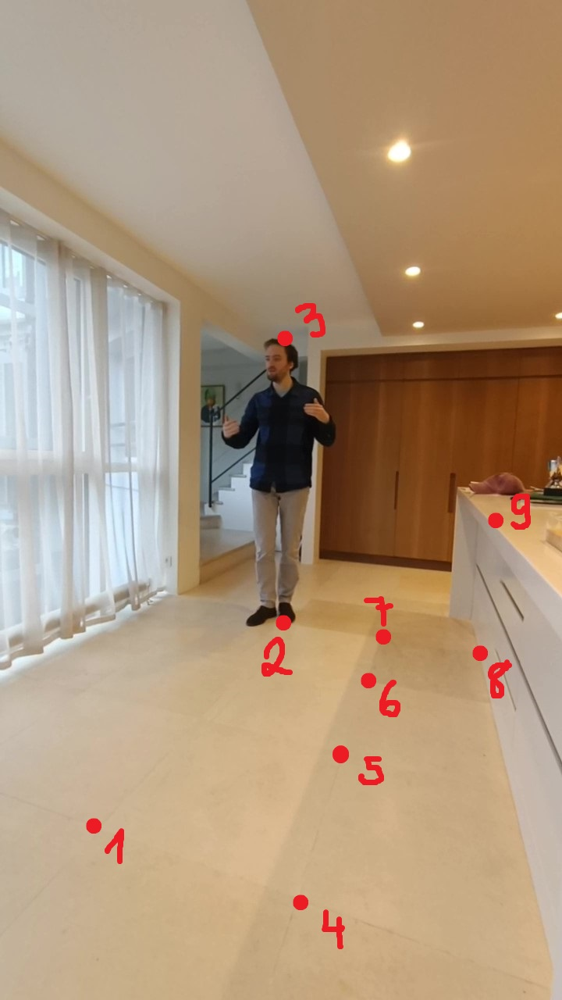

## Reproducing the results

To obtain the results above, I installed the Pose2Sim pip package [following the installation steps](https://github.com/perfanalytics/pose2sim/?tab=readme-ov-file#installation-and-demonstration) and then followed the steps described in [The Pose2Sim repo on GitHub](https://github.com/perfanalytics/pose2sim/?tab=readme-ov-file#use-on-your-own-data) to get the kinematocs data, here is a summary of the steps I followed:
- I populated the videos folder with the video I wanted to analyze, I needed to duplicate it as the algorithm assumes we have at least two camera angles of the same scene.
- I populated the calibration folder with the necessary pictures for the calibration process.
- I made sure to be inside the `Demo_SinglePerson` folder (ie I typed `cd obtain_kinematics/Demo_SinglePerson` in the terminal).
- I typed `ipython` in the terminal to open the ipython console.
- I ran the following commands in the ipython console:
```python
from Pose2Sim import Pose2Sim
Pose2Sim.poseEstimation()
Pose2Sim.calibration()
Pose2Sim.synchronization()
Pose2Sim.personAssociation()
Pose2Sim.triangulation()
Pose2Sim.filtering()
Pose2Sim.markerAugmentation()
Pose2Sim.kinematics()
```
- I then checked the `kinematics` folder for the joint angles data (in the `Demo_SinglePerson_P1_0-412_filt_butterworth.mot` file) and the `pose-3d` folder for the 3D pose data (in the `Demo_SinglePerson_P1_0-412_filt_butterworth.trc` file).

## Possible problems

I encountered problems during the calibration phase with OpenCV, I had to uninstall the `opencv-python` package and install the `opencv-python-headless` package to solve the issue. 
```bash
pip uninstall opencv-python
pip install opencv-python-headless
```
However, this should only be done after the pose estimation phase as the `opencv-python-headless` package does not have the necessary GUI functionalities of the `opencv-python` package. Thus, what should be done is to install the `opencv-python` package, execute the `Pose2Sim.poseEstimation()` command, then uninstall the `opencv-python` package and install the `opencv-python-headless` package, and then proceed with the calibration phase and the rest of the steps.

## Additional notes

During the calibration step, to get the extrinsic parameters, 10 points will need to be pointed on the images, the points should be selected in the order drawn on this image:



